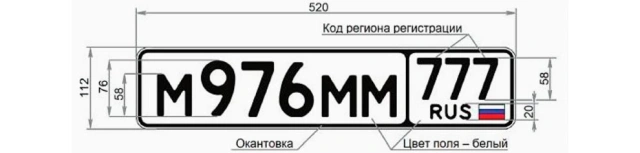

# auto_num_gen
**SQL - скрипт**, генерирующий госномера для автомобилей, такси, автобусов, прицепов, мотоциклов и тракторов для всех регионов РФ

## Стек:
PostgreSQL

### Правила генерации номеров, без учета номера региона:
А 000 АА — у автомобилей  
АА 000 — у такси, автобусов для перевозки людей  
АА 0000 — у прицепов  
0000 АА — у мотоциклов, тракторов  

